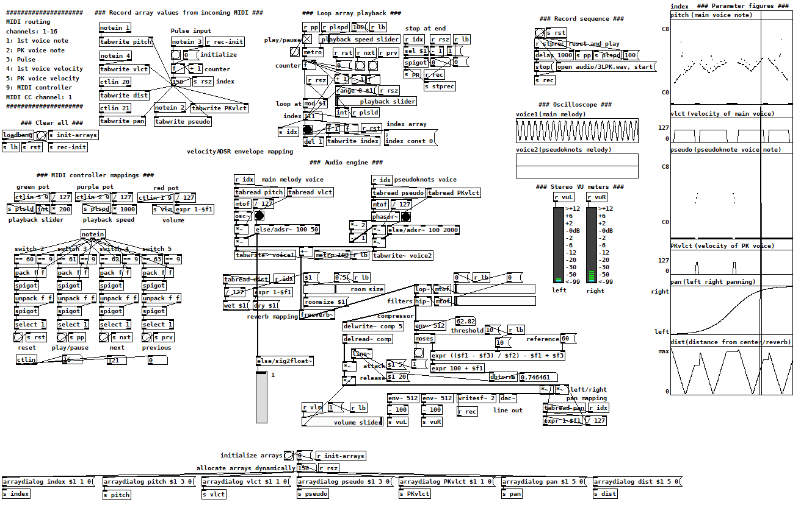

# Sonification of RNA secondary structure

Pure Data and Ableton Live are optionally required. Check:
- [https://puredata.info](https://puredata.info/)
- [https://www.ableton.com](https://www.ableton.com/)

Also, a (virtual) MIDI port is optionally required.

### Using virtual MIDI ports

A MIDI port transfers MIDI information that is then saved to the MIDI file created.
  
This MIDI information dictates the sounds that will play depending on the RNA secondary structure sequence imported.

- For Windows environments check:
[https://www.tobias-erichsen.de/software/loopmidi.html](https://www.tobias-erichsen.de/software/loopmidi.html)

- For Unix environments check:
[https://wiki.debian.org/AlsaMidi](https://wiki.debian.org/AlsaMidi)

- Mac environments offer native virtual MIDI ports

## Steps to do if you wanna hear any sounds

1. Open Pure Data and load `sonification-template.pd`, or open Ableton Live and load `sonification-template.als`

2. Run `python createMIDI.py` in a terminal.
    
   If there are no input arguments, a random  RNA secondary structure in CSSD format will be created (`randomRNA.py` is called), else you can input as an argument any specific .txt file located in the 'RNA structures' directory you want to sonify.
    
   A MIDI file containing information concerning how the sonnified RNA should sound like will be saved. The same MIDI information will also be passed through any open MIDI ports.

3. If step 1 was bypassed but still wanna hear something, import the .mid files generated in the previous step here: [https://onlinesequencer.net/import](https://onlinesequencer.net/import) 
   
## Audio mappings

### Pitch frequency

| CSSD        | Nucleobase         | Pitch            |
|:-----------:|:------------------:|:----------------:|
| `(`         | helix opening      | up               |
| `)`         | helix closing      | down             |
| `<`         | base pair opening  | up               |
| `>`         | base pair closing  | down             |
| `[`         | pseudoknot opening | arpeggio up      |
| `]`         | pseudoknot closing | arpeggio down    |
| `_`         | hairpin loop       | pause            |
| `:`         | unstructured       | pause            |
| `-`         | interior loop      | chord & repeat   |
| `,`         | unpaired           | dissonance/random|

### Space

- Sound direction: mapped to sequence index
- Reverberation: mapped to index distance from center
  
## Pure Data patch

1. Record MIDI
2. Store MIDI info in arrays
3. Generate audio engine
4. Playback MIDI info
5. Record/explore audio

